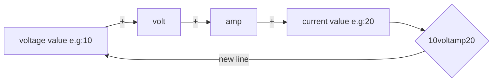
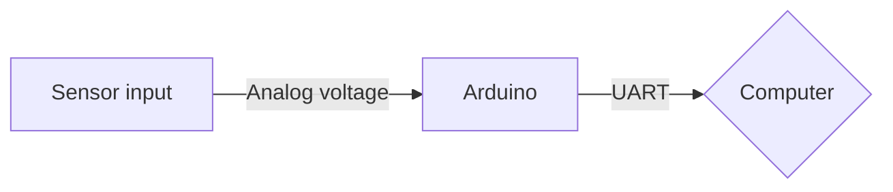

# Voltage and Current Graph with LabVIEW

The purpose of this project is to observe the output voltage and current of any device by using Arduino and LabVIEW.
This project is quite simple and it teaches the basic serial communication procedure of LabVIEW.
After building a power supply for my electronics laboratory I need to observe some output with a computer for data logging. After this requirement, I decided to make an interface that shows voltage and current. Also, this project is homework.
There are two parts to this project. The first part includes electronic and embedded software.

# 1-Hardware and Embedded Software

In order to detect voltage and current, I used the UAV flight controller power module. It has a voltage regulator, voltage divider, shunt resistor, and amplifier for boosting the voltage obtained by the shunt resistor. Also working voltage range is compatible with Arduino or another TTL level microcontroller. For these reasons I prefer a flight controller power module, if you don't you can use a voltage divider, shunt resistor, and basic amplifier (it can be an opamp or special IC for following current).
And then I wrote a simple code for reading the signals and sending them through the serial port. The trick of the code is calibration and print function. Also at the end of the code, there is a 1ms wait function for stability. 1ms i.e 1KHz sampling rate is pretty enough for most applications but it can increase.
The software reads the input signals and divides a calibration constant then sends data through the serial port. The structure of the data is given below.

Flow chart of the hardware:

Flow chart of the hardware:

The second part of the system process the incoming data with LabVIEW.

# 2-LabVIEW

Incoming data captures by using the VISA library and tools. VISA tools give string data at the output. In the output string, find tools search "volt" and "amp". The output voltage value comes before "volt" and the output current value comes after "amp". And then these values enter string converters which are used for getting a numerical type output. At the output of the converters, data multiply with a constant number for calibration. After all, the result and graph plots.

  

The block diagram of LabVIEW is given below.

Thanks for reading my project and if you have a question, you can send me an e-mail (seckinalbamya@gmail.com).

Regards
73 de TA3UAS!
