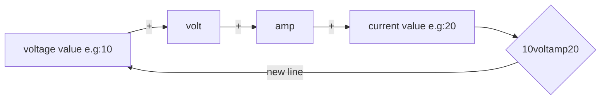
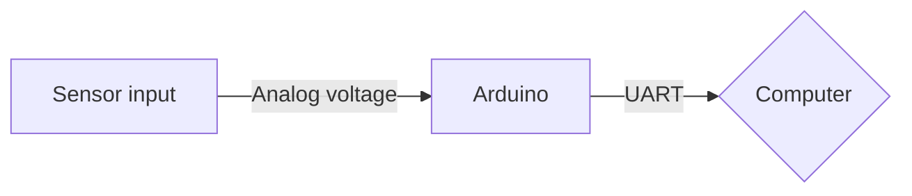

# Voltage and Current Graph with LabVIEW

Purpose of this project is observe the output voltage and current of any device by using Arduino and LabVIEW.

This project is quite simply and it teachs the basic serial communication procedure of LabVIEW.

After building a power supply for my electronics laboratuary I need to observe some output with computer for data logging. After this requirement I decided to make a interface which shows voltage and current. Also this project is a homework.

There are two parts in these project. First part includes electronic and embedded software.

# 1-Hardware and Embedded Software
In order to detect voltage and current I used UAV flight controller power module. It has voltage regulator, voltage divider, shunt resistor and amplifier for boost the voltage which obtained by shunt resistor. Also working voltage range is compatible wiht Arduino or anothet TTL level microcontroller. For this reasons I prefer flight controller power module, if you don't you can use voltage divider, shunt resistor and basic amplifier (it can be opamp or special IC for following current).

And then I wrote a simply code for reading the signals and sending through serial port. The trick of the code is calibration and print function. Also at the end of the code there is a 1ms wait function for stability. 1ms i.e 1KHz sampling rate is pretty enough for most application but it can increase.

The software reads the input signals and divides a calibration constant then it sends data through serial port. The structer of data is given below.

Flow chart of the hardware:

The second part of the system process the incoming data with LabVIEW. 

# 2-LabVIEW

Incoming data captures by using VISA library and tools. VISA tools give string data at the output. In the output string, find tools search "volt" and "amp". The output voltage value comes before "volt" and output current value comes after "amp". And then this values enter string converters which are used for getting a numerical type output. At the output of the converters data multiplies with a constant number for calibration. After all of process the result and graph plots. 

The block diagram of LabVIEW is given below.

Thanks for reading my project and if you have a question, you can send me e-mail (seckinalbamya@gmail.com).
